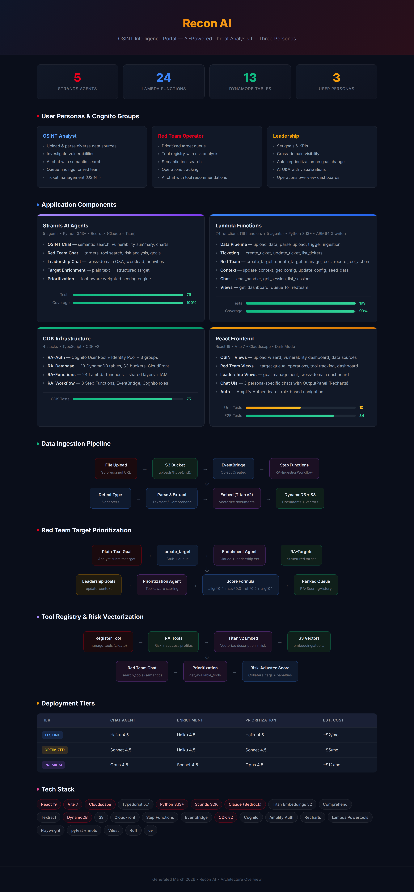

# Recon AI

[](LICENSE)


OSINT Intelligence Portal -- unified platform for OSINT analysts, red team operators, and leadership. Data flows through smart parsing pipelines into vectorized storage, enabling AI-powered search, tool-aware target prioritization, and persona-specific chat agents with risk analysis.

## Table of Contents

- [Architecture Overview](#architecture-overview)
- [How It Works](#how-it-works)
- [Tech Stack](#tech-stack)
- [Prerequisites](#prerequisites)
- [Quick Start](#quick-start)
- [Testing](#testing)
- [DynamoDB Tables](#dynamodb-tables-13)
- [Lambda Functions](#lambda-functions-19)
- [Agents](#agents-5)
- [Deployment Tiers](#deployment-tiers)
- [Key Design Decisions](#key-design-decisions)
- [Known Issues & Improvement Areas](#known-issues--improvement-areas)
- [Project Status](#project-status)

## Architecture Overview

Click the image below to view the full architecture diagram:

[](docs/images/architecture.png)

See the interactive [Architecture Overview](docs/architecture.html) for the full HTML version.

## How It Works

1. **OSINT analysts** upload data (Shodan, Nmap, CSV, logs, PDFs) via presigned S3 URLs
2. **EventBridge** triggers a Step Functions ingestion workflow: detect type, parse/extract (Textract + Comprehend), embed with Titan v2, store in DynamoDB + S3 vectors
3. Analysts investigate findings, create tickets, and **queue targets for red team**
4. **Red team operators** submit plain-text goals that get auto-enriched into structured targets via a Strands agent
5. **Leadership** sets goals and KPIs, which triggers the **Prioritization Agent** to re-score all targets using a weighted formula that factors in tool availability, risk profiles, and success rates
6. **Three AI chat agents** (OSINT, Red Team, Leadership) provide persona-specific Q&A with semantic search across all vectorized data, tool recommendations with risk trade-offs, and auto-generated Recharts visualizations
7. **Tool registry** lets operators register security tools with risk/success profiles that are vectorized for semantic search and factored into prioritization

## Tech Stack

| Layer | Technology | Notes |
|-------|-----------|-------|
| **Frontend** | React 19, Vite 7, TypeScript 5.7, Cloudscape 3 | Dark mode default, direct DynamoDB/Lambda SDK calls |
| **Auth** | Amplify Authenticator, Cognito User Pool + Identity Pool | 3 groups: osint-analyst, red-team-analyst, leadership |
| **Backend** | Python 3.13+, uv, AWS Lambda (ARM64 Graviton) | 19 Lambda handlers, Lambda Powertools v3 |
| **Agents** | Strands SDK | 5 agents: 3 chat + enrichment + prioritization |
| **AI** | Claude via Amazon Bedrock, Titan Embeddings v2 | Tiered: Haiku/Sonnet/Opus per deployment |
| **NLP** | Comprehend, Textract | Entity extraction, PDF/image OCR |
| **Database** | DynamoDB (on-demand, PITR) | 13 tables (RA- prefix), S3 for uploads + vectors |
| **Orchestration** | Step Functions, EventBridge | 3 workflows: ingestion, enrichment, prioritization |
| **Infra** | CDK v2 TypeScript | 4 stacks, Jest assertion tests |
| **Hosting** | S3 + CloudFront | `deploy-frontend.sh` for updates |
| **Testing** | pytest + moto, Vitest, Playwright, Jest | 199 backend, 79 agent, 75 CDK, 10 unit, 34 E2E |
| **Linting** | ruff (Python), TypeScript strict mode | Line length 120, target py313 |

## Prerequisites

- **Node.js 22+** and npm
- **Python 3.13+** and [uv](https://docs.astral.sh/uv/)
- **AWS CLI v2** configured with a profile that has CDK deploy permissions
- **AWS CDK CLI** (`npm install -g aws-cdk`)
- **jq** (for scripts)
- **Docker** (for CDK Lambda layer bundling during `cdk deploy`)

## Quick Start

```bash
# 1. CDK infrastructure
cd apps/infra && npm install
AWS_PROFILE=cdk-deploy-prod npx cdk deploy --all --require-approval never

# 2. Populate frontend env vars from CloudFormation outputs
./scripts/setup-env.sh

# 3. Frontend dev server
./dev.sh
```

Create users in Cognito and assign to groups: `osint-analyst`, `red-team-analyst`, `leadership`.

## DynamoDB Tables (13)

| Table | PK | SK | GSIs | TTL |
|-------|----|----|------|-----|
| RA-DataSources | sourceId | -- | -- | -- |
| RA-Uploads | uploadId | -- | AnalystIndex, StatusIndex | -- |
| RA-Documents | uploadId | documentId | -- | 365d |
| RA-Tickets | ticketId | -- | OwnerIndex, StatusIndex, TypeIndex, TargetIndex | -- |
| RA-TicketNotes | ticketId | noteId | -- | -- |
| RA-Targets | targetId | -- | StatusIndex(status, priorityScore) | -- |
| RA-LeadershipContext | contextId | -- | -- | -- |
| RA-ToolActions | ticketId | actionId | -- | -- |
| RA-Tools | toolId | -- | CategoryIndex, StatusIndex | -- |
| RA-ChatSessions | userId | sessionId | -- | 90d |
| RA-ChatMessages | sessionId | messageId | -- | 90d |
| RA-Config | configKey | -- | -- | -- |
| RA-ScoringHistory | runId | -- | -- | 90d |

All tables: on-demand billing, PITR enabled, AWS-managed encryption.

## CDK Stacks (4)

| Stack ID | Purpose |
|----------|---------|
| RA-Auth | Cognito User Pool + Identity Pool + 3 groups |
| RA-Database | 13 DynamoDB tables, S3 buckets (uploads, vectors, hosting), CloudFront |
| RA-Functions | 24 Lambda functions (19 handlers + 5 agents) + shared layers + IAM + CloudWatch alarms |
| RA-Workflow | 3 Step Functions, EventBridge trigger, Cognito identity pool role bindings |

## Lambda Functions (19)

| Function | Phase | Purpose |
|----------|-------|---------|
| `upload_data` | 1 | Generate presigned S3 URL + RA-Uploads record |
| `parse_upload` | 1 | Route by sourceType, extract/embed via adapter pattern |
| `get_config` | 1 | Read runtime config |
| `update_config` | 1 | Write runtime config |
| `seed_data` | 1 | CDK custom resource: seed sources + config |
| `trigger_ingestion` | 1 | Start vectorization workflow |
| `create_ticket` | 2 | Create RA-Tickets + initial RA-TicketNotes entry |
| `update_ticket` | 2 | Status transitions (state machine), notes append |
| `list_tickets` | 2 | Query tickets by GSI (owner/status/type/target) |
| `get_dashboard` | 2 | Aggregated dashboard data per persona |
| `queue_for_redteam` | 2 | OSINT finding -> red team target |
| `create_target` | 3 | Accept plain-text goal, create stub, start enrichment |
| `update_target` | 3 | Status transitions, manual field edits |
| `manage_tools` | 3 | CRUD for RA-Tools + vectorize risk/success profiles |
| `record_tool_action` | 3 | Write RA-ToolActions entry |
| `update_context` | 3 | Save leadership goals, trigger re-prioritization |
| `chat_handler` | 4 | Invoke persona-specific Strands agent |
| `get_session` | 4 | Retrieve chat session + messages |
| `list_sessions` | 4 | List user's past sessions |

## Agents (5)

| Agent | Model | Trigger | Purpose |
|-------|-------|---------|---------|
| OSINT Chat | Haiku/Sonnet/Opus (tier) | chat_handler | Semantic search, vulnerability summary, threat charts |
| Red Team Chat | Haiku/Sonnet/Opus (tier) | chat_handler | Targets, tool search with risk analysis, operations |
| Leadership Chat | Haiku/Sonnet/Opus (tier) | chat_handler | Cross-domain Q&A, workload, activities, visualizations |
| Target Enrichment | Haiku/Sonnet (tier) | Step Functions | Plain-text goal -> structured target with severity/effort |
| Prioritization | Haiku/Sonnet/Opus (tier) | Step Functions | Tool-aware weighted scoring against leadership goals |

### Red Team Chat Agent Tools

| Tool | Type | Purpose |
|------|------|---------|
| `search_documents` | Semantic | Search all vectorized intelligence data |
| `search_tools` | Semantic | Find tools by capability, risk, target type, or CVE |
| `get_tool_registry` | Structured | Full listing of registered tools by category/status |
| `get_priority_targets` | Structured | Prioritized targets sorted by score |
| `get_tool_history` | Structured | Past tool actions against targets |
| `get_leadership_goals` | Structured | Current strategic context |
| `generate_chart_config` | Output | Recharts-compatible JSON for visualizations |

### Tool Registry & Risk Analysis

Tools are registered with structured risk and success profiles, then automatically vectorized for semantic search:

| Dimension | Values | Impact |
|-----------|--------|--------|
| Service Disruption | none / low / medium / high / critical | High = could take down services |
| System Damage | none / low / medium / high / critical | Critical = could destroy infrastructure |
| Detection Likelihood | low / medium / high | High = SOC will likely notice |
| Success Rate | 0-100% | Factors into effort scoring |
| Reversible | yes / no | Irreversible = permanent damage risk |
| Noisy | yes / no | Noisy = high traffic/log generation |
| Required Access | network / local / physical | Higher access = harder to execute |
| Output Type | shell / data / credential / dos | Type of result on success |

The prioritization agent uses this data to:
- Reduce scores for targets where only high-collateral-risk tools are available
- Boost scores when stealthy, high-success-rate tools exist
- Tag targets with `no-tooling-available` or `high-collateral-risk` warnings
- Factor tool detection likelihood into urgency scoring

## Cognito Groups & Permissions

| Group | Capabilities |
|-------|-------------|
| osint-analyst | Upload data, create/update tickets, queue for red team, chat, dashboard |
| red-team-analyst | Create/update targets, manage tools, record tool actions, tickets, chat, dashboard |
| leadership | Set goals/KPIs, cross-domain chat, dashboard, config |

## Frontend Views

| View | Persona | Key Components |
|------|---------|---------------|
| Upload Wizard | OSINT | File upload with source type selection, presigned S3 URLs |
| Vulnerability Dashboard | OSINT | Data sources, ingestion status, document explorer |
| Target Queue | Red Team | Prioritized targets sorted by composite score |
| Red Team Operations | Red Team | Operations planning, tool tracking |
| Red Team Dashboard | Red Team | Target stats, operations overview |
| Goal Management | Leadership | Goals, KPIs, priority weights, planning window |
| OSINT Chat | OSINT | AI Q&A with semantic search + Recharts visualizations |
| Red Team Chat | Red Team | Tool recommendations with risk analysis + charts |
| Leadership Chat | Leadership | Cross-domain Q&A, workload, activities + charts |

## Step Functions Workflows (3)

| Workflow | Timeout | Trigger | Steps |
|----------|---------|---------|-------|
| RA-IngestionWorkflow | 15 min | S3 EventBridge (Object Created) | DetectType -> ParseData -> EmbedDocuments -> UpdateStatus |
| RA-EnrichmentWorkflow | 5 min | create_target Lambda | EnrichTarget (Strands agent) |
| RA-PrioritizationWorkflow | 10 min | update_context Lambda | ScoreAllTargets (Strands agent) |

## Data Source Adapters

| Adapter | File Types | Extraction Method |
|---------|-----------|-------------------|
| `shodan_json` | .json | JSONL parsing, vulnerability flagging |
| `nmap_xml` | .xml | XML host/port extraction |
| `social_csv` | .csv | CSV DictReader |
| `log_text` | .log | Line chunking with severity detection |
| `document_textract` | .pdf, .png, .jpg, .tiff | Textract OCR + optional Comprehend |
| `text_passthrough` | .txt, other | UTF-8 decode + paragraph chunking |

## Deployment Tiers

| Tier | Chat Agent | Enrichment | Prioritization | Est. Cost |
|------|-----------|------------|----------------|-----------|
| `testing` | Haiku 4.5 | Haiku 4.5 | Haiku 4.5 | ~$2/mo |
| `optimized` | Sonnet 4.5 | Haiku 4.5 | Sonnet 4.5 | ~$5/mo |
| `premium` | Opus 4.5 | Sonnet 4.5 | Opus 4.5 | ~$12/mo |

Set via `deploymentTier` in `config.json`.

## Testing

```bash
# Backend functions (199 tests, 99% coverage)
cd apps/functions && uv run pytest tests/ --cov=. --cov-report=term-missing -q

# Agent modules (79 tests)
cd apps/agents && uv run pytest tests/ --cov=. --cov-report=term-missing -q

# CDK infrastructure (75 tests)
cd apps/infra && npm test

# Frontend unit (10 tests)
cd apps/web && npm test

# Frontend E2E -- Playwright (34 tests)
cd apps/web && npm run test:e2e

# E2E deployed backend (11 tests against live AWS)
AWS_PROFILE=cdk-deploy-prod ./scripts/test-deployed.sh
```

## Key Design Decisions

- **No API Gateway** -- frontend calls DynamoDB + Lambda directly via Cognito identity pool credentials
- **Adapter pattern** -- single parse_upload Lambda with pluggable adapters for each data source type
- **Three separate chat agents** -- focused tool surfaces and system prompts per persona, not one multi-persona agent
- **S3 vectors + in-memory cosine similarity** -- no OpenSearch needed for <10K document corpus
- **Tool vectorization** -- risk profiles, success rates, and derived pros/cons embedded alongside documents for semantic search
- **Tool-aware prioritization** -- scoring factors tool availability, collateral risk, detection likelihood, and success rates
- **Weighted formula** -- alignment*0.40 + severity*0.30 + (100-effort)*0.20 + urgency*0.10 with leadership-configurable weights
- **Ticket state machine** -- new -> triaging -> investigating -> active -> completed -> closed
- **Comprehend for entity extraction** -- budget-conscious; LLMs reserved for semantic enrichment and chat
- **Manual tool tracking with automation hooks** -- executionType and apiEndpoint fields in RA-ToolActions for future automation

## S3 Key Structure

Upload paths follow: `uploads/{sourceType}/{uploadId}/{fileName}`

The EventBridge trigger parses uploadId and sourceType from this path when initiating the ingestion workflow.

Tool vectors stored at: `embeddings/tools/{toolId}.json`

Document vectors stored at: `embeddings/{uploadId}/{batch}.json`

## Critical Constraints

- **Prioritization weights must sum to ~1.0** -- `update_context` validates this before saving
- **Target status transitions are enforced** -- queued -> enriched -> active -> in_progress -> completed (with re-open and cancel paths)
- **Tool vectorization is fire-and-forget** -- embedding failure does not block tool creation
- **S3 vectors with in-memory cosine** -- designed for <10K documents; OpenSearch needed beyond that
- **Chat sessions have 90-day TTL** -- messages auto-expire
- **`seed_data` uses `attribute_not_exists`** -- admin changes survive re-deploys
- ULIDs for time-sortable unique identifiers (targetId, ticketId, toolId, sessionId)

## Deployment

```bash
# Deploy all stacks
cd apps/infra && npm install
AWS_PROFILE=cdk-deploy-prod npx cdk deploy --all --require-approval never

# Deploy frontend to S3 + CloudFront
./deploy-frontend.sh
```

## Known Issues & Improvement Areas

### High (P1)

| Issue | Location | Description |
|-------|----------|-------------|
| S3 vectors fully re-downloaded per search | `shared/chat_tools.py:43-61` | Every `search_documents` call downloads all S3 vector files; no caching |
| No Step Functions error handlers | `workflow-stack.ts:92-95` | No `addCatch()` on ingestion workflow; failures leave uploads stuck in "processing" |
| S3 CORS allows all origins | `database-stack.ts:201` | Uploads bucket `allowedOrigins: ['*']`; should be restricted |

### Medium (Code Quality)

| Issue | Location | Description |
|-------|----------|-------------|
| Three identical chat agent handlers | `osint/redteam/leadership_chat_agent/handler.py` | Same code except import path; use a handler factory |
| `formatters.ts` utilities mostly unused | `src/utils/formatters.ts` | Components define inline versions instead |
| No SNS alarm topic subscriptions | `auth-stack.ts` | Alarm topic created but nobody receives alerts |
| `setup-env.sh` incomplete | `scripts/setup-env.sh` | Only fetches 10 of 24 Lambda function names |
| Hardcoded DynamoDB table names in frontend | `api.ts` | Should come from env config |

### Infrastructure

| Issue | Description |
|-------|-------------|
| No S3 bucket versioning | Upload data not recoverable if overwritten/deleted |
| No Lambda reserved concurrency | Runaway invocations could exhaust account limits |
| No DLQ on Lambda/Step Functions | Failed invocations silently lost |
| Hardcoded table names in CDK | Prevents multi-environment deployments to same account |
| No CloudFront security headers | Missing CSP, HSTS, X-Content-Type-Options |
| `--require-approval never` in deploy scripts | Skips IAM change review for all deployments |

## Project Status

| Phase | Status | Scope |
|-------|--------|-------|
| 1. Foundation | Complete | CDK infra, upload pipeline, frontend shell |
| 2. OSINT Dashboard + Ticketing | Complete | Ticket CRUD, dashboards, queue for red team |
| 3. Red Team Workflow | Complete | Target management, tool registry + vectorization, prioritization |
| 4. AI Chat Agents | Complete | 3 persona-specific chat agents, tool search, risk analysis |
| 5. Visualization + Leadership | Planned | React Flow topology, advanced dashboards |
| 6. Testing + PSP Registration | Planned | 95%+ coverage, E2E, PSP integration |

See [CLAUDE.md](CLAUDE.md) for full architecture documentation.
